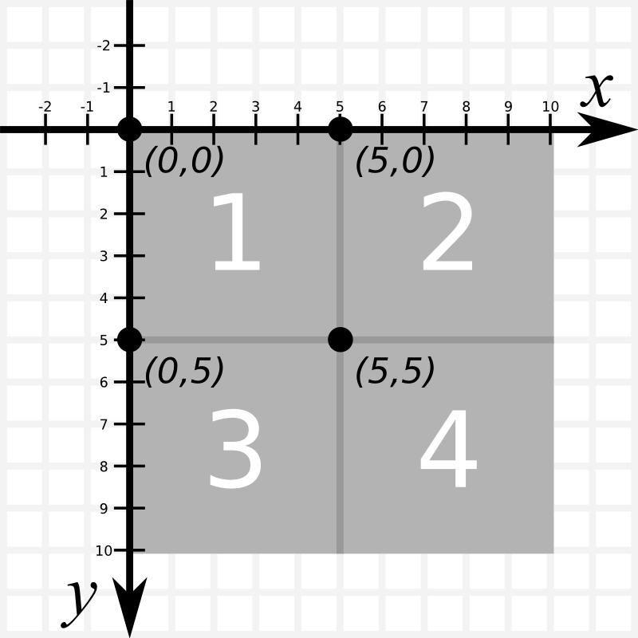
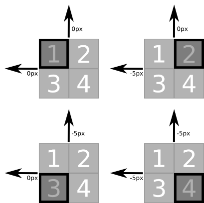
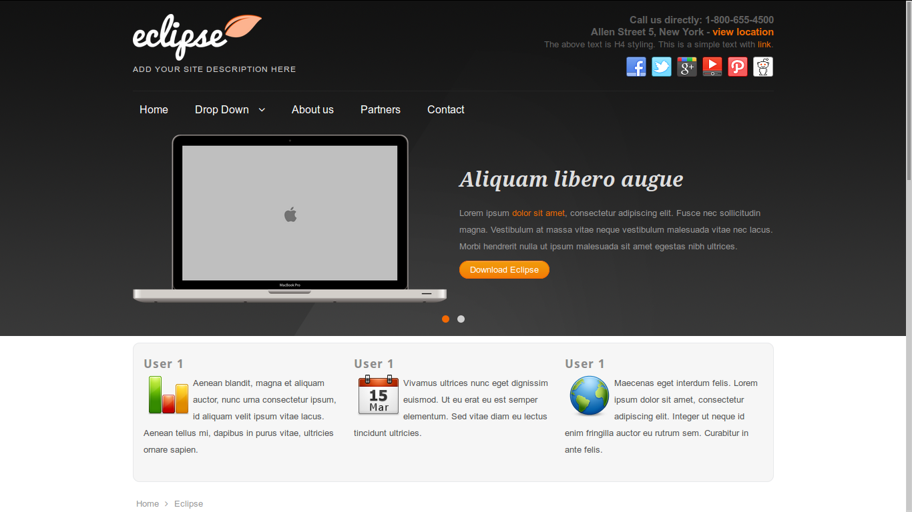
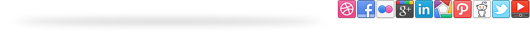

% Využitie technológie CSS SPRITE pri tvorbe webových aplikácií
% Bc. Roman Mátyus

# Úvod

Technológia CSS Sprite je určená pre zrýchlenie načítavania obrázkov vo webovej aplikácií. Podstatou prínosu je minimalizovanie počtu HTTP požiadaviek na server a zníženie objemu prenášaných hlavičiek obrázkov. Toto sa zabezpečí zľúčením čo najväčšieho počtu obrázkov do jediného zloženého obrázku.

# Popis technológie CSS Sprite

Pri používaní tejto techniky sú všetky obrázky použité v grafike, ak spĺňajú kritériá, zľúčené tak, aby z nich vznikol jeden obrázok obsahujúci obsah všetkých čiastkových obrázkov.

Následne je pozmenený obsah CSS súbora. Je potrebné identifikovať súradnice a rozmery jednotlivých čiastkových obrázkov. Tieto súradnice sa najčastejšie používajú na vytvorenie nových tried v CSS a sú zapísané v atribútoch `background-position`. Týmito triedami sú následne označené jednotlivé HTML elementy ktorých pozadie má obsahovať daný čiastkový obrázok. Informácie o súradniciach je možné použiť aj priamo na úpravu pôvodného CSS súboru. Takáto úprava je pracnejšia, ale nie je nutné modifikovať pôvodný HTML kód.

## Výstupný súbor PNG

Najčastejším výstupným formátom pri tejto technike je PNG.

Tento súborový formát v sebe zľučuje viacero výhod:

- relatívne malá výsledná veľkosť,
- bezstratová kompresia,
- priehľadnosť pozadia.

Pri jeho použití treba dbať aj na jeho dve obmedzenia:

- nepodporuje animácie ako GIF,
- Internet Explorer 6 (a staršie) nepodporujú priehľadnosť.

Použitie PNG nemusí byť vyslovene pravidlom, pretože vhodne vytvorený GIF súbor, resp. JPG súbor s kompresiou môžu dosahovať lepšie výsledky. Všetko závisí od vstupných súborov. Ak by bolo na vstupe napríklad viacero väčších obrázkov v truecolor, tak by malo zmysel uvažovať o JPG výstupe. JPG bude úplne diskvalifikovaný, ak bude niektorý obrázok na vstupe obsahovať priesvitnú časť.

## Súradnicový systém

Pri určovaní pozície zobrazovaného výrezu je použitý dvojrozmerný súradnicový systém s osou *x* a *y*. Koordináty *[0, 0]* označujú ľavý horný roh. Vertikálna os *y* nenadobúda kladné hodnoty smerom hore, ako je to štandardne, ale dolu.



Tiež je dôležité uvedomiť si, že sa nemení pozícia zobrazeného výrezu, ale vo výreze sa posúva pozadie.



Z uvedeného vyplýva, že prakticky každý výrez spritu bude mať počiatočné koordináty *x <= 0* a *y <= 0*.

Pravidlu sa vymykajú prípady cieleného zobrazenia obrázka iba v časti objektu. Keďže pre tieto extrémne prípady nie je reálne opodstatnenie, budú v práci ignorované.

## Výhody

### Úspora počtu HTTP požiadaviek

Namiesto množstva samostatných požiadaviek server vráti jediný obrázok s jednou hlavičkou. Dôsledkom je zníženie počtu volaní a tým pádom aj záťaže servera.

Pri požiadavkách na server sa prenáša relatívne mnoho informácií[^http-poziadavka-na-server]. Tieto informácie sú teda v bežnom prípade prenášané pre každý obrázok samostatne a teda dochádza k mnohonásobnej duplicite prenosu.

Keďže je veľkosť HTTP hlavičiek veľmi rôznorodá, je vhodné spoľahnúť sa na štatistické údaje. Priemerná veľkosť hlavičky pri HTTP prenose je aktuálne 700 až 800 bytov[^priemerna-http-hlavicka]. Pre účely porovnávania bude braná do úvahy spodná hranica odhadu - 700 bytov.

[^http-poziadavka-na-server]: Hlavičky obsahujúce informácie o prehliadači, cookies a iné.
[^priemerna-http-hlavicka]: http://dev.chromium.org/spdy/spdy-whitepaper, online, 27.3.2014

### Úspora prenášaných dát

Každý prenášaný obrázok obsahuje okrem obsahovej časti aj svoju hlavičku. V prípade spojenia obrázkov do jedného, je ušetrený prenos hlavičiek pre každý súbor zvlášť.

Táto vlastnosť nemusí byť vždy výhodou. Často sa stáva, že obrázky nie je možné vo výslednom obrázku optimálne rozmiestniť a výsledný obrázok má väčšiu plochu (px^2^) ako je súčet plôch samostatnch obrázkov. Vďaka kompresií obrázka to nemusí nutne znamenať priamo úmerné zväčšenie dátového súboru obrázka, dokonca niekedy je dôsledok opačný.

*Sprite* je možné po vygenerovaní optimalizovať a tým výrazne znížiť jeho veľkosť.

### Okamžitá dostupnosť obrázka

Webový grafici často vyžadujú zmenu grafiky po interakcií kurzora[^interakcie-kurzora] s nejakým elementom na stránke. Toto je zväčša prakticky vyriešené zmenou obrázka pozadia na úrovni CSS. V tomto prípade nastáva problém s oneskoreným načítaním pozadia. Prehliadač zaregistruje potrebu vykreslenia obrázka, ale ten ešte nie je k dispozícií. Preto oň server požiada a stiahne ho. Toto môže bežne trvať približne pol sekundy. Keďže toto prebliknutie kazí používateľský zážitok z používania aplikície, dizajnéri niekedy vytvárajú čiastkové *sprity* zložené z pôvodného pozadia a pozadia po interakcií. Toto je žiaľ pracné a nesystémové riešenie.

[^interakcie-kurzora]: Umiestnenie kurzora nad element, kliknutie naň a iné.

## Nevýhody

### Pracnosť

Pri manuálnom vytvorení *spritu* je potrebné spojiť všetky vyhovujúce obrázky do jedného, vyrátať pozície jednotlivých obrázkov a vypočítané pozície zápisať do CSS súboru. Najpracnejším spôsobom je spracovávať požadované súbory v grafickom editore a manuálne dopisovať potrebné pozície do CSS súboru.

Možným zjednodušením je importovanie zdrojových súborov do nástroja generujúceho *sprite* obrázok použitím vhodného algoritmu. Takto získaný súbor je potrebné manuálne spracovať – aplikovať pozície zdrojových obrázkov do požadovaného CSS súboru.

Niektoré generátory poskytujú ako výstup automaticky triedy CSS štýlov s pozíciami pôvodných obrázkov na základe vygenerovaného obrázka. Tieto triedy sa dajú následne jednoducho aplikovať priamo v HTML prípadne sa dajú použiť CSS preprocesorom SASS, LESS alebo inými.

### Náročnosť generovania

V prípade použitia generátora za behu aplikácie by mohlo vzniknúť oneskorenie z dôvodu výpočtovej náročnosti generovania obrázka a jeho následné dosadenie do zdrojového súboru. Keďže žiaľ funkčné nástroje generujúce *CSS Sprite* za behu aplikácie aktuálne neexistujú, nie je to akútny problém. Problém je taktiež jednoducho riešiteľný kešovaním.

### Veľkosť obrázka

V ideálnom prípade by sprite obrázok obsahoval množinu obrázkov zhodných rozmerov. Výsledný obrázok by teda mal plochu v px^2^ zhodnú so súčtom plôch jednotlivých obrázkov. V reálnom nasadení sa toto nestáva a teda pri tvorbe obrázka dochádza k vzniku prázdnych miest. Tento efekt je síce  nežiadúci, ale nie kritický, pretože prázdne miesta zaberajú relatívne málo bytov. 

Dátová veľkosť výsledného obrázka je často dokonca menšia ako súčet veľkostí vstupných obrázkov. Ak sú vstupné obrázky vhodných rozmerov nevzniká nevyplnený priestor a ušetrí sa prenos n-1 hlavičiek súborov. Úspora vzniká aj vyššou mierou kompresie väčšieho obrázka oproti kompresii malých vtupných obrázkov.

Problém prázdneho miesta v *sprite* je čiastočne riešiteľný:

- použitím vhodného algoritmu rozvrhnutia elementov,
- zvolením najvhodnejšieho výstupného súboru prípadne
- použitia kompresie pri ktorej nedochádza k evidentnému znehodnoteniu kvality výstupu.

Vhodné podmienky výstupu je možné pri niektorých aktuálne použiteľných generátoroch manuálne nastaviť. Jednoduchým riešením je aj zmenšiť farebnú hĺbku výstupu.

Zvoliť vhodný algoritmus volieb výstupného súboru nemusí byť vždy ľahké. Hlavne v prípade ak sú na vstupe výborne optimalizované obrázky, môže byť výstup zo štandardných generátorov bez extra nastavenia, prípadne ďalšej úpravy v externom editore, výrazne dátovo väčší ako súčet veľkosti dát obrázkov na vstupe. V takomto prípade treba previesť merania a zistiť či sa oplatí takto pregenerovaný súbor nasadiť.

Vždy to záleží od konkrétneho nasadenia, je však veľmi pravdepodobné, že sa aplikácia techniky napriek väčšiemu objemu oplatí vďaka úspore HTTP požidaviek.

### Zväčšenie obsahu CSS

Použitím CSS Sprite je nutné preniesť informácie o pozicovaní obrázkov k používateľom a teda zväčšiť množstvo prenášaných dát. Generátory zväčša vytvárajú vlastné sekcie do CSS súborov ktoré sa majú aplikovať priamo v HTML kóde. Dopad tejto nevýhody je možné minimalizovať napríklad tak, že namiesto dopísania nových CSS štýlov sú dodané štýly pozmenené a tak následne distribuované. Toto sa v praxi používa v závislosti od schopností generátora prípadne kódera ktorý pracúva CSS Sprite obrázok manuálne. Väčšina generátorov touto funkcionalitou nedisponuje vzhľadom na relatívne zložitú implementáciu keďže je mnoho spôsobov ako môže dôjsť ku sporom v definícií štýlov a následnému znehodnoteniu dizajnu.

### Úprava HTML

Veľkou nevýhodou je pri použití štandardných generátorov nutnosť meniť CSS triedy súborov priamo v HTML kóde webu. Tieto úpravy môžu byť niekedy pracné a neprehľadné. Podstatne vhodnejšie by bolo iba upraviť kód v triedach metódou sspomenutou v predošlom odstavci. Tým by bola zachovaná spätná kompatibilita.

### Obmedzenia CSS

Samotný návrh štandardu CSS neobsahuje dokonalú podporu pre CSS Sprite. Táto technika je preto použiteľná iba na určitú množinu obrázkov, nie na všetky.

#### Vzorka

Štandardne nie je možné túto techniku využiť na obrázky ktoré sú vzorkou - opakovane vypĺňajú pozadie v nejakom smere.

V prípade ak sa to oplatí, je možné toto obmedzenie čiastočne eliminovať a vygenerovať viac typov obrázkov pre každý typ opakovania. Jeden *sprite* pre obrázky ktoré sa neopakujú a ďalšie zvlášť pre horizontálne a vertikálne opakované pozadia. Dôsledkom môžu byť až tri výsledné súbory. Ak je na stránke definovaných väčšie množstvo horizontálne/vertikálne sa opakujúcich pozadí môžu sa tým získať výrazné úspory.

Z technológie vyplýva, že v prípade horizontálneho opakovania by musel byť každý obrázok najprv upravený na šírku toho najširšieho. Obdobne to platí pre vertikálne opakované obrázky. Obrázky ktoré sa podla definície majú opakovať v horizontálnom aj vertikálnom smere nemôžu byť v CSS Sprite obrázkoch vôbec použité.

#### Pozicovanie pozadia

Problém nastáva aj v prípade, ak je pozadie elementu pozicované relatívne.[^relativne-pozicovanie] Pozície musia byť buď nulové, alebo určené v pixeloch.

[^relativne-pozicovanie]: Percentuálne alebo top, bottom, left, right a center.

### Formát vstupných súborov

Z dôvodu nepodporovania animácie pri PNG súboroch[^standard-exportu], nemôže byť štandardne do *spritu* zaradený žiadny animovaný GIF. Toto obmedzenie sa dá teoreticky obísť vďaka simulácií animácie použitím techník CSS3.

[^standard-exportu]: Formát PNG je štandardne používaný ako výstupný formát *sprite* obrázka.

### Prenášanie nepotrebných dát

V prípade použitia *spritov* je prenášaný komplexný obrazec obsahujúci všetky čiastkové obrázky. Z toho dôvodu môžu nastať prípady, keď sa používateľovy odošlú aj obrazové body, ktoré nie sú pre aktuálne zobrazenie potrebné. Dôsledkom je o niečo menšia efektivita použitia technológie.

Problém je čiastočne minimalizovaný menšou výslednou veľkosťou *spritu* ako je súčet veľkostí vložených obrázkov. Preto nie sú dôsledky kritické.

Pre zmenšenie dopadu tohoto problému je potrebné udržovať v CSS súboroch poriadok. Obsahom majú byť iba definície, ktoré sú pre daný dizajn potrebné. Ak je táto podmienky splnená a obrazec sa na strane klienta uchováva v dočasnej pamäti, prakticky je problém eliminovaný. Aj keď sa pri prvom spojení prenesú nejaké byty s nepotrebnými frakmentami obrázkov, budú neskôr použité a vo výsledku ušetria komunikáciu so serverom.

Jednotlivé *sprity* je vhodné vytvárať pre každý CSS súbor zvlášť a nie až po zľúčení odosielaných CSS súborov. Ak bude množstvo CSS súborov veľmi variabilné, boli by generované *sprity* pre rôzne pohľady rôzne. Toto by spôsobovalo problémy s efektným využívaním dočasnej pamäte.

## Konkurenčné riešenie Data URL

Pre úplnosť je vhodné spomenúť konkurenčnú techniku urýchlenie načítania webu pomocou Data URL[^specifikacia-data-url]. Pri tejto technike je v CSS odkaz na súbor (obrázok) nahradený za hlavičku a textovú reprezentáciu obrázka kódovaním base64. Hlavnou nevýhodou je zväčšenie prenášaného množstva dát o 33% oproti originálu. Preto býva technika používané iba na veľmi malé obrázky, kde je absolútny nárast veľkosti iba v bytoch.

Zaujímavou možnosťou sa javí kombinácia *CSS Sprite* a *Data URL* tak, že sa do *Data URL* prevedú obrázky, ktoré nemohli byť z nejakého dôvodu zaradené do *spritu*.

Možným obmedzením je problematická podpora pseudoprotokolu `data` v Internet Exploreri 8 a starších. IE 8 podporuje *Data URL* s maximálnou veľkosťou 32 kB a staršie nepodporujú túto funkciu vôbec.

[^specifikacia-data-url]: http://tools.ietf.org/html/rfc2397

: Porovnanie štandardného volania obrázkov, Data URI a CSS Sprite

--------------------------------------------------  ----------------------  ------------------------  ------------
                                                      štandardné volanie            Data URI           CSS Sprite
--------------------------------------------------  ----------------------  ------------------------  ------------
Počet HTTP komunikácií pre zobrazenie `n` obrázkov            `n`                        0                 1     

Veľkosť dát oproti originálu                                zhodná                    + 33 %            ± zhodná

Cache                                                       možné            nutnosť cachovania CSS       možné
--------------------------------------------------  ----------------------  ------------------------  ------------

Štruktúra takéhoto reťazca je podla špecifikácie nasledovná:

    data:[<mediatype>][;base64],<data>

### Príklad

Namiesto

	background: white url('dot.png')

je cesta k súboru v CSS nahradená za textovú reprezentáciu obrázka a štýl vyzerá nasledovne:

	background: white url('data:image/png;base64,iVBORw0KGgoAAAANSUh
	EUgAAAAUAAAAFCAYAAACNbyblAAAAHElEQVQI12P4//8/w38GIAXDIBKE0DHxglj
	NBAAO9TXL0Y4OHwAAAABJRU5ErkJggg==')

# Referenčný dizajn

Ako referenčný dizajn pre testovanie postupov, rôzne merania a analýzu som pri práci zvolil open source šablónu pre CMS Joomla s názvom Eclipse[^eclipse]. Šablóna bola vybratá náhodne. Podmienkou výberu bol moderný dizajn a otvorený zdrojový kód pre licenčne bezprobĺémové použitie v práci. Šablónu je možné stiahnuť z webstránky [joomlatemplates.me](http://joomlatemplates.me/wp-content/plugins/download-monitor/download.php?id=14).

[^eclipse]: http://joomlathemes.co/demo3x/eclipse



## Analýza podkladov

Šablóna obsahuje spolu 6 CSS súborov. Súbory *bootstrap.min.css*, *font-awesome.min.css*, *font-awesome-ie7.min.css* neobsahujú žiadne obrázky, takže nie sú relevantné pre spracovanie. Súbor *flexslider.css* obsahuje iba jediný obrázok, takže *sprite* taktiež nemá zmyseľ.

V súbore `styles.css` sa nachádza definícia vzhľadu samotnej šablóny.

Obsahuje 17 obrázkov s nasledujúcimi definíciami:

Názov súboru         Použiteľný pre CSS Sprite?        Veľkosť           Rozmer              Plocha
-----------------  ------------------------------  ---------------  ----------------  ---------------------
bg.png                       horizontálne              19,0 kB         50 x 600 px        30 000 px^2^
header.png                       nie                   18,8 kB        980 x 600 px        588 000 px^2^
facebook.png                     áno                    1,9 kB         32 x 32 px          1 024 px^2^
twitter.png                      áno                    2,1 kB         32 x 32 px          1 024 px^2^
google.png                       áno                    2,0 kB         32 x 32 px          1 024 px^2^
youtube.png                      áno                    2,0 kB         32 x 32 px          1 024 px^2^
dribbble.png                     áno                    2,8 kB         32 x 32 px          1 024 px^2^
flickr.png                       áno                    2,0 kB         32 x 32 px          1 024 px^2^
pinterest.png                    áno                    2,2 kB         32 x 32 px          1 024 px^2^
picasa.png                       áno                    2,6 kB         32 x 32 px          1 024 px^2^
linkedin.png                     áno                    1,9 kB         32 x 32 px          1 024 px^2^
reddit.png                       áno                    1,9 kB         32 x 32 px          1 024 px^2^
more.png                     horizontálne               1,4 kB          1 x 36 px            36 px^2^
sidebar-li2.png                  nie                    1,5 kB          7 x 7 px             49 px^2^
sidebar-li1.png                  nie                    1,5 kB          7 x 7 px             49 px^2^
arrow_up.png                     nie                    1,3 kB         50 x 50 px          2 500 px^2^
error.png                        áno                    1,9 kB        560 x 72 px          1 024 px^2^
**SPOLU**                                            **66,8 kB**                        **631 898 px^2^**

: Detailný rozbor obrázkov

### Výpočet náročnosti prenosov

Pre určenie vhodnosti použitia techniky je potrebné určiť metriky podla ktorých sa určí vhodnosť použitia. Sledovanými veličinami bude počet volaní servera a úspora množstva prenášaných dát.

Pri výpočtoch sa do úvahy berie iba súbor `styles.css` a relevantné obrázky z neho odkazované.

#### Počet HTTP požiadaviek

Prioritným dôvodom zavedenia tejto techniky je ušetrenie počtu volaní servra.

Pri použití pôvodného súboru `styles.css` je prenášaných 17 samostatných PNG obrázkov.

#### Objem prenášaných dát

Objem prenášaných dát zahŕňa dve množiny prenášaných údajov. Na jednej strane sledujeme množstvo bytov HTTP hlavičiek a na druhej samotnú veľkosť súborov.

Vzhľadom na to, že je potrebné preniesť 17 samostatncýh obrázkov a približne 700 bytov hlavičiek na jeden súbor, je výsledná veľkosť relevantných HTTP hlavičiek 11,6 kB.

Súčet veľkostí obrázkov je 66,8 kB. Veľkosť CSS súboru nie je relevantná.

# Manuálne vytvorenie CSS Spritu

## Spracovanie obrazových podkladov

V programe Gimp[^gimp] som čo najoptimálnejšie manuálne vyskladal obrázky. Výsledkom sú dva obrazce. Pre minimalizovanie vonkajších vplyvov pri porovnávaní rôznych riešení nebola použitá žiadna extra optimalizácia výstupu, iba integrovaná kompresia vrámci štandardu PNG.

[^gimp]: http://www.gimp.org

Prvý *sprite* s názvom *manual-sprite-horizontal.png* obsahuje súbory *bg.png* a *more.png* pod sebou. Súbor *bg.png* mal pôvodne šírku 50 px. Vzhľadom na nutnosť rovnakej šírky všetkých použitých horizontálnych obrázkov som manuálne zúžil obrázok na 1 px. Bolo to možné, pretože súbor obsahuje iba prechod a nie zložitejšiu vzorku.

Druhý zostavený súbor, *manual-sprite.png*, obsahuje zvyšných 11 použiteľných obrázkov. Najprv som do ľavého horného rohu umiestnil najväčší obrázok - *error.png*. Následne som vedla neho vpravo vyskladal zvyšné použiteľné obrázky.

V rámci manuálneho skladania som vyskúšal umiestniť logá sociálnych sietí do dvoch radov, ale z dôvodu spôsobu fungovnia kompresie PNG to spôsobilo nárast dátovej veľkosti obrázka o 439 B. Od toho som ustúpil, pretože je prioritnejšia výsledná dátová veľkosť súboru a nie percentuálne využitie plochy obrázka.

Z dôvodu snahy o minimalizáciu počtu obrázkov, som sa pokúsil vložiť do obrázku `manual-sprite.png` aj horizontálne opakované obrázky `bg.png` a `more.png`. Pri tomto postupe je nutné roztiahnuť horizontálne sa opakujúce obrázky na celú šírku obrázka. Pre zúženie obrázka na minimum som vykladal ikony sociálnych sietí pod najširší obrázok `error.png`. Po spracovaní vznikol obrazec s rozmermi 560 x 740 px a veľkosťou 44,4 kB. V tomto prípade je teda dôsledkom úspora prenosov o jeden obrázok, ale veľkosti obrázku je až 44,4 kB oproti súčtu obrázkov dvoch samostatných spritov - 13,8 kB. Z dôvodu viacnásobného zväčšenia spritu som v tomto konkrétnom prípade postup zavrhol. V niektorých vhodnejších prípadoch môže poskytovať zaujímavé výsledky.



Názov súboru                      Veľkosť      Dátová úspora[^datova-uspora]         Rozmer         Využitosť plochy[^vyuzitost-plochy]
------------------------------  -----------  ---------------------------------  ----------------  ---------------------------------------
manual-sprite-horizontal.png       5,8 kB                  3460 %                 1 x 636 px                     100 %
manual-sprite.png                 13,2 kB                  177 %                 880 x 72 px                     79,8 %

: Porovnanie *spritov* a pôvodných obrázkov.

[^datova-uspora]: Pomer súčtu dátovej veľkosti jednotlivých čiastkových obrázkov s výsledným obrázkom.
[^vyuzitost-plochy]: Pomer súčtu plôch jednotlivých čiastkových obrázkov (v sprite) s rozmerom výsledného obrázka.

Zoznam súborov      Súradnice
----------------  -------------
bg.png                 0,0
more.png               0,600

: Zoznam obrázkov v *manual-sprite-horizontal.png*


Zoznam súborov      Súradnice
----------------  -------------
dribbble.png         560,0
facebook.png         592,0
flickr.png           624,0
google.png           656,0
linkedin.png         688,0
picasa.png           720,0
pinterest.png        752,0
reddit.png           784,0
twitter.png          816,0
youtube.png          848,0
error.png              0,0

: Zoznam obrázkov v *manual-sprite.png*

## Úprava CSS súboru

Pre aplikáciu výsledných obrázkov je potrebné previesť zodpovedajúce zmeny v súbore `styles.css`. Zmeny sa týkajú výhradne názvu odkazovaného obrázka a súradníc pozadia.

Nasledujúce fragmenty kódu obsahujú všetky reálne potrebné zmeny. Posledný riadok v oboch ukážkach sa v súbore nachádza dva krát - v dvoch rôznych definíciách.

### Pôvodný súbor

```
background: #3e3e3e url(../images/bg.png) 0 0 repeat-x;
background:url(../images/social/facebook.png) 0 0 no-repeat;
background:url(../images/social/twitter.png) 0 0 no-repeat;
background:url(../images/social/google.png) 0 0 no-repeat;
background:url(../images/social/youtube.png) 0 0 no-repeat;
background:url(../images/social/dribbble.png) 0 0 no-repeat;
background:url(../images/social/flickr.png) 0 0 no-repeat;
background:url(../images/social/pinterest.png) 0 0 no-repeat;
background:url(../images/social/picasa.png) 0 0 no-repeat;
background:url(../images/social/linkedin.png) 0 0 no-repeat;
background:url(../images/social/reddit.png) 0 0 no-repeat;
background:#f26b04 url(../images/more.png) 0 0 repeat-x;

```

### Zmenený súbor

```
background: #3e3e3e url(../images/manual-sprite-horizontal.png) 0 0 repeat-x;
background:url(../images/manual-sprite.png) -592px 0 no-repeat;
background:url(../images/manual-sprite.png) -816px 0 no-repeat;
background:url(../images/manual-sprite.png) -656px 0 no-repeat;
background:url(../images/manual-sprite.png) -848px 0 no-repeat;
background:url(../images/manual-sprite.png) -560px 0 no-repeat;
background:url(../images/manual-sprite.png) -624px 0 no-repeat;
background:url(../images/manual-sprite.png) -752px 0 no-repeat;
background:url(../images/manual-sprite.png) -720px 0 no-repeat;
background:url(../images/manual-sprite.png) -688px 0 no-repeat;
background:url(../images/manual-sprite.png) -784px 0 no-repeat;
background:#f26b04 url(../images/manual-sprite-horizontal.png) 0 -600px repeat-x;
```

## Výpočet užitočnosti

Pre určenie vhodnosti použitia techniky je potrebné určiť metriky podla ktorých sa určí vhodnosť použitia. Sledovanými veličinami bude počet volaní servera a úspora množstva prenášaných dát.

Vplyv na zmenu veľkosti zdrojového CSS súboru nebudeme brať do úvahy, pretože je zanedbateľný a väčšinový vplyv má naň názov vytvoreného obrázka. Ten bol zvolený samopopisne a nie dátovo úsporne, takže by to prípadnú štatistiku výrazne skreslilo. Prírastok veľkosti súboru spôsobený zmenou pozicovania je iba 60 bytov.

### Počet HTTP požiadaviek

Prioritným dôvodom zavedenia tejto techniky je ušetrenie počtu volaní servra.

Pri použití pôvodného súboru `styles.css` bolo prenášaných 17 PNG obrázkov. Po aplikovaní zmien je potrebné preniesť iba x obrázkov - 2 *sprite* obrázky a 4 obrázky ktoré nemohli byť pre obmedzenia technológie použité.

Výsledkom je úspora 11 spojení na server, čo prestavuje úsporu 64,7 % počtu požiadaviek. Vo výpočte sú brané do úvahy iba obrázky zo súboru `styles.css`.

### Objem prenášaných obrázkov

Po zmene je potrebné preniesť HTTP hlavičky pre šiestich rôznych obrázkov. To znamená, že veľkosť HTTP hlavičiek bude približne 4,1 kB.

Súčet veľkostí šiestich prenášaných obrázkov je 42,1 kB, čo predstavuje úsporu 28,1 % prenášaných obrázkových dát. Vo výpočte sú brané do úvahy iba obrázky zo súboru `styles.css`.

# Existujúce generátory

## Sprite Me

http://spriteme.org/

## CSS Sprite Generator (Project Fondue)

http://spritegen.website-performance.org/

## CSS Sprites Generator

http://csssprites.com/

## CSS Sprite Creator

http://www.web2generators.com/graphism/css_sprite_creator

# Vlastné riešenie

## Popis funkčnosti

## Riešenie netriviálnych problémov

### Opakovanie

Ak chceme do *spritu* zaradiť aj obrázok ktorý je vykraslovaný ako opakované pozadie, musí sa v danej osi nachádzať v celej šírke/výške obrázka.

### Obmedzenie CSS

### Formát súborov

## Spätná väzba

# Záver